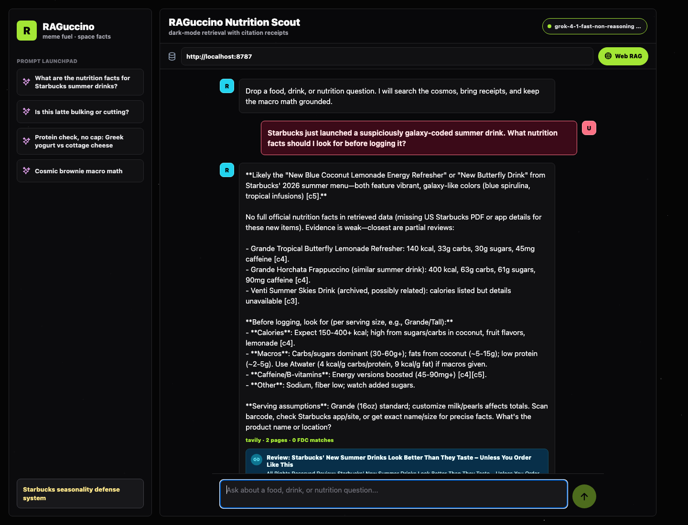

# RAGuccino Nutrition Scout

**Suggested name:** RAGuccino Nutrition Scout.

It starts with **RAG**, says what it does, and keeps the exact production pain point
easy to remember: Starbucks can drop a new seasonal drink before static food tables
catch up. This app gives a model a retrieval layer so it can look up nutrition facts,
cite internet sources, and explain serving assumptions.

RAGuccino is a standalone Expo + Node app designed to solve a production problem in
Spotter: the coach needs grounded nutrition answers for foods and drinks the base
model may not know about. Spotter website: https://www.spotter-labs.com



Dark-mode retrieval, citation receipts, and just enough meme energy to keep Starbucks
seasonal drink chaos from winning.

## What This App Does

- Runs in the browser through Expo Web.
- Provides a simple chat UI for asking nutrition and general web questions.
- Sends chat turns to a local Node RAG API.
- Uses a web-search API to retrieve current internet sources.
- Optionally uses USDA FoodData Central for structured food nutrition data.
- Calls an OpenAI-compatible model using env variables you enter locally.
- Returns answers with citation cards in the web UI.
- Keeps model keys and search keys on the local server. The browser app only sees the
  local API URL.

## Project Vault

This repo includes a documentation vault at [`vault/`](./vault/Home.md). It is meant to
work like the Spotter vault: architecture, setup, math, testing notes, and product
intent live in Markdown so the app remains explainable after the first build pass.

Start with:

- [`vault/Home.md`](./vault/Home.md)
- [`vault/rag-architecture.md`](./vault/rag-architecture.md)
- [`vault/math-and-confidence.md`](./vault/math-and-confidence.md)
- [`vault/testing-on-web.md`](./vault/testing-on-web.md)

## APIs To Enable

Required:

1. **Model API**
   - Use OpenAI API or an OpenAI-compatible endpoint.
   - Env vars: `MODEL_BASE_URL`, `MODEL_API_KEY`, `MODEL_NAME`.
   - OpenAI example:
     - `MODEL_BASE_URL=https://api.openai.com/v1`
     - `MODEL_NAME=gpt-4.1-mini`
   - Azure AI Foundry / Azure OpenAI example:
     - Use the OpenAI-compatible base URL for your resource.
     - Set `MODEL_NAME` to the deployed model/deployment name.

2. **Web Search API**
   - Recommended for this demo: **Tavily Search API**.
   - Alternative: **Brave Search API**.
   - Env vars:
     - `SEARCH_PROVIDER=tavily`
     - `TAVILY_API_KEY=...`
     - or `SEARCH_PROVIDER=brave`
     - `BRAVE_SEARCH_API_KEY=...`

Optional:

3. **USDA FoodData Central API**
   - Enables structured nutrition facts for generic and branded foods.
   - Env var: `FDC_API_KEY=...`
   - Free signup: https://fdc.nal.usda.gov/api-key-signup

No key required:

4. **Open Food Facts**
   - Product pages can appear through web search.
   - A direct barcode adapter can be added later with their public API and required
     attribution.

## Local Setup

```bash
cd ~/Developer/RAGuccino-Nutrition-Scout
npm install
```

The local secret file is `.env.local`. It is ignored by git. The Azure model values
were copied from Spotter's `apps/web/.env.local`; paste the remaining search/nutrition
keys into this same file.

Example `.env.local` shape:

```text
EXPO_PUBLIC_RAG_API_URL=http://localhost:8787
PORT=8787

AZURE_FOUNDRY_ENDPOINT=https://YOUR-RESOURCE/openai/v1
AZURE_FOUNDRY_API_KEY=YOUR_AZURE_KEY
AZURE_FOUNDRY_MODEL=YOUR_DEPLOYMENT_NAME
MODEL_AUTH_HEADER=authorization

SEARCH_PROVIDER=tavily
TAVILY_API_KEY=tvly-...
FDC_API_KEY=...
```

Run the server:

```bash
npm run server
```

In another terminal, run Expo:

```bash
npm run web
```

Expo opens the browser. If it does not, open the URL printed by the Expo CLI, usually
`http://localhost:8081`. If the app shows `API offline`, confirm that `npm run server`
is still running and that the server field says `http://localhost:8787`.

## Web Testing Checklist

- Server terminal shows `RAGuccino API listening`.
- `/health` returns `modelConfigured: true` and `searchConfigured: true`.
- The app server field uses `http://localhost:8787`.
- Ask: `What are the nutrition facts for Starbucks summer drinks?`
- The answer includes citation cards.
- Tap a citation and confirm it opens in a new browser tab.

## Technical Architecture

```text
Browser / Expo Web
  |
  | POST /api/chat
  v
Node RAG API
  |
  +-- Tavily or Brave web search
  +-- safe page fetch + HTML cleanup
  +-- USDA FoodData Central lookup for nutrition facts
  +-- retrieval scoring + citation packaging
  +-- Azure AI Foundry / OpenAI-compatible model call
  |
  v
Grounded answer + citations
```

The browser never receives model, search, or nutrition API keys. It only knows
`EXPO_PUBLIC_RAG_API_URL`, which points to the local API server.

### Runtime Endpoints

| Endpoint | Method | Role |
|---|---|---|
| `/health` | `GET` | Reports whether model, web search, and FDC keys are configured. |
| `/api/chat` | `POST` | Accepts recent chat messages, runs retrieval, calls the model, and returns `{ answer, citations, retrieval }`. |

### RAG Flow

1. The user sends a chat message from the Expo Web UI.
2. The Node API validates recent messages and extracts the latest user question.
3. If web search is enabled, the server calls Tavily or Brave.
4. For nutrition-looking questions, the server also queries USDA FoodData Central when `FDC_API_KEY` is present.
5. The server fetches the top public pages, blocks private/local hosts, strips scripts/styles/comments, and extracts relevant snippets.
6. Search results, fetched snippets, and FDC records become compact citation objects.
7. The model receives the user question plus retrieved context and must cite claims with citation IDs.
8. The UI renders the answer, retrieval summary, and clickable citations.

## Software Used

Web UI:

- Expo SDK 56
- React 19
- React Native 0.85
- React Native Web
- TypeScript
- `@expo/vector-icons` for controls and citation links

Local RAG API:

- Node.js 22
- Built-in `node:http`
- Built-in `fetch`
- `.env.local` / `.env` loading from `server/env.mjs`
- OpenAI-compatible `/chat/completions` call
- Azure AI Foundry-compatible endpoint support, including endpoints that already end in `/chat/completions`
- Tavily or Brave web search
- USDA FoodData Central REST lookup

Retrieval:

- Query-term scoring for snippets.
- Search result ranking.
- Server-side page fetching with private-host blocking.
- HTML cleanup and snippet extraction.
- Citation packaging for the web app.
- Nutrition-specific source routing through USDA FDC.
- Model grounding prompt that treats retrieved pages as evidence only.

## Math Used

### Atwater Calories

Nutrition labels often provide calories, protein, carbs, and fat. The app computes an
Atwater check when macros are available:

```text
kcal_atwater = protein_g * 4 + carbs_g * 4 + fat_g * 9
```

Example:

```text
20g protein, 35g carbs, 12g fat
kcal = 20*4 + 35*4 + 12*9
kcal = 328
```

### Label Delta

When a source has both label calories and macros:

```text
delta_percent = abs(label_kcal - kcal_atwater) / label_kcal * 100
```

This catches serving-basis mismatches, rounded label values, and weak source data.

### Portion Scaling

For nutrients listed per 100 g:

```text
scaled_value = nutrient_per_100g * consumed_grams / 100
```

For nutrients listed per serving:

```text
scaled_value = nutrient_per_serving * servings_consumed
```

### Retrieval Scoring

The current server uses a simple lexical score:

```text
score = matched_query_terms / total_query_terms
```

Fetched pages can improve their score when page text matches the query better than the
search-result snippet. This is intentionally transparent for a demo. A future version
can add embeddings, reciprocal rank fusion, and reranking.

### Confidence Sketch

Food confidence is computed from source quality, serving clarity, macro/calorie
agreement, and exact-match signals:

```text
confidence = clamp(
  base
  + source_authority * 0.25
  + serving_clarity * 0.20
  + agreement * 0.20,
  0,
  1
)
```

Current source authority examples:

- USDA Foundation food: high
- USDA branded food: medium-high
- Web page snippet: depends on domain and serving evidence

## Repo Map

```text
RAGuccino-Nutrition-Scout/
  App.tsx                 # Expo Web chat UI
  server/
    index.mjs             # local API: /health and /api/chat
    env.mjs               # .env loader and setup status
    search.mjs            # web search, page fetch, FDC lookup, citations
    model.mjs             # OpenAI-compatible chat completion call
    nutritionMath.mjs     # Atwater, scaling, confidence helpers
  src/
    lib/types.ts          # mobile/API types
  vault/                  # Obsidian-style docs for the repo
```

## Production Path Back To Spotter

The production version should become a server-side read tool in Spotter:

1. Spotter receives a user message.
2. The coach decides it needs nutrition retrieval or web search.
3. Spotter calls a deployed version of this RAG API from `apps/web`.
4. The RAG API returns citations, food facts, confidence, and assumptions.
5. Spotter's model answers or creates a pending macro log.
6. The user confirms the write through Spotter's existing pending-action rail.

That keeps the current Spotter safety model intact while improving current nutrition
coverage for new products, restaurant items, and seasonal drinks.
